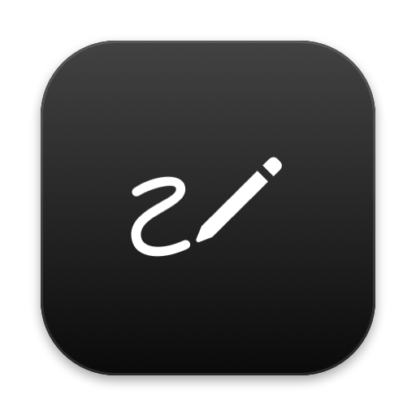

<p align="center"></p>

# Clarify

Tidy up text you already wrote, without it stopping sounding like you.

Select text in any app and run Clarify. A small black panel opens by the pointer with your text as an inline diff: struck-through words are what Claude would take out, highlighted words are what it would put in. A line above says what changed and what is still unclear. Press Replace (⌘↩) and the selection is replaced.

It fixes spelling, grammar and punctuation, and makes the idea land. Code references get backticks, snippets go in fenced code blocks, and logic written out in prose becomes tidy pseudo code, with the code itself left untouched. It does not add ideas, greetings or sign-offs, and it does not make you sound formal. Use it on a Slack reply before you send it, or on a messy note you want to think through.

## Talking back

Type under the diff and press Return:

- "skip the change to the second sentence"
- "keep 'aswell', that's how the team writes it"
- "add that the fix is already on master"
- "is this too blunt for a partner?"

Each instruction stays in force for the next ones. A question gets an answer in the notes and leaves the text alone.

To give Claude something to look at, such as the thread you are replying to, paste an image with ⌘V, drop one onto the panel, or press the camera button for a screenshot of the display under the pointer. Each image shows as a small square. Click a square to preview it, click its × to remove it. A new image is not sent until you press ↑ or Return, and after that it goes with every turn until removed.

The panel keeps talking and finishing apart. The bar at the bottom talks to Claude: type, then press ↑ or Return. The buttons above it finish: **Replace** (⌘↩) puts the result over your selection and **Copy** copies it. The × in the top corner, or Esc, closes without changing anything.

## Scratch pad

Run Clarify Scratch Pad from Raycast (give it a hotkey) or `clarify-scratchpad` to open an empty pad at any time. Type, paste or dictate a draft; Return adds a line and ⌘↩ clarifies it. From there it works as above, and ⌘↩ pastes the result into the app you were in when you opened the pad.

The pad takes focus, so dictation tools that type into the front app, such as Wispr Flow or macOS Dictation, write straight into it. Running the command again while a pad is open brings it back rather than starting over. Clarify Selection also opens the pad when nothing is selected.

There is no hotkey by default. To open the pad from anywhere, set one with `clarify-hotkey option+shift+c` (any mix of cmd, option, control and shift with a letter, digit, space or return). A hotkey already used by Claude Code, the Claude desktop quick entry shortcut or speak is refused, with the owner named, so the tools never clash. `clarify-hotkey` shows the current one and `clarify-hotkey off` removes it. The setting lives in `~/.config/clarify/settings.json` as `scratchPadHotkey`. While one is set, Clarify itself stays running in the background from login and catches the hotkey directly, which is what lets the pad come to the front with the cursor in it while you are busy in another app. It needs no permissions. A hotkey on the Raycast command works just as well if you prefer that. An option hotkey takes over the character it normally types, for example ⌥⇧C types Ç, so that character is lost while it is set.

## Your voice

Clarify reads `~/.config/clarify/voice.md` into every request. Write down how you write: length, tone, spelling, habits to keep, things you never say. A few real examples help most. `voice.example.md` is the starting template, and the install copies it there if the file is missing.

## Install

Needs macOS, Claude Code signed in, and `swiftc` from the Xcode command line tools.

```sh
./install.sh
```

This builds the app into `build/Clarify`, runs the diff tests, links `clarify-selection` into `~/.local/bin`, and installs a Clarify Quick Action.

Ways to run it:

- Right-click selected text > Services > Clarify. Give it a hotkey in System Settings > Keyboard > Keyboard Shortcuts > Services > Text.
- Raycast: add `raycast/` as a Script Directory, or install with `RAYCAST_SCRIPTS_DIR=<dir> ./install.sh`.
- Any launcher or shell: `clarify-selection`. It reads stdin when piped, otherwise it copies the current selection.

## Permissions

For Clarify Selection, the app that launches it (Raycast, the Services runner, your terminal) asks for these. For the scratch pad, Clarify asks for them itself. A rebuild signs the app afresh, so macOS may ask again after one.

- Accessibility, to paste the result back over the selection. Without it the result is copied and you press ⌘V yourself. `clarify-selection` also needs it to copy the selection when nothing is piped in.
- Screen Recording, only for the camera button.

## Settings

Open Clarify Settings from the gear in the panel, the Clarify Settings command in Raycast, or `clarify-settings`. It has three things:

- Scratch pad hotkey: press Record Shortcut, then the keys you want. Clear removes it. There is none by default.
- Model: Sonnet by default, or Opus or Haiku.
- Your voice: the voice guide, saved as you type.

Everything is stored in `~/.config/clarify/`: `settings.json` for the hotkey and model, `voice.md` for the voice guide.

## How it works

The install builds `build/Clarify.app`, a small AppKit app with no Dock icon. `bin/clarify-selection` gets the selected text and runs the app with it piped in; that panel does not take focus, so the app you were in stays in front and keeps its selection. `bin/clarify-scratchpad` opens the app with `open`, which brings it to the front so typing and dictation land in the pad, and brings an open pad back instead of starting a second one.

Every turn runs `claude -p` with no tools, no settings, no MCP servers and no saved session. The request carries the original text, the current draft, every instruction so far, and any attached images, scaled down to 1568px on the longest side. Claude replies with `<notes>` and `<text>`. The diff is always against the original, so you see the full change at once.

Replacing the selection puts the result on the clipboard, sends ⌘V to the front app, and puts your old clipboard text back.

## Development

```sh
./install.sh
printf 'teh text to tidy' | build/Clarify.app/Contents/MacOS/Clarify
clarify-scratchpad
```
